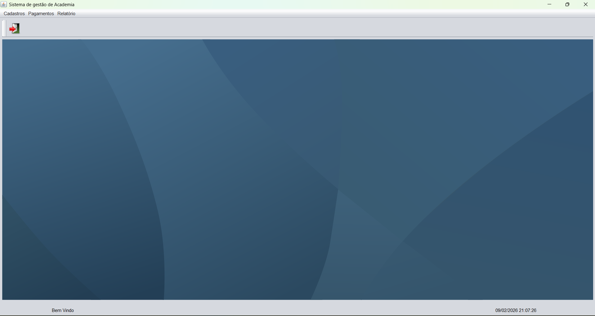
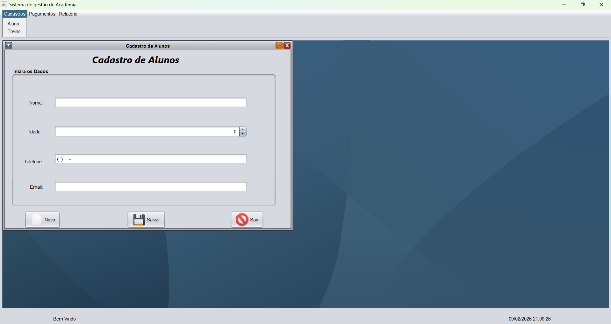
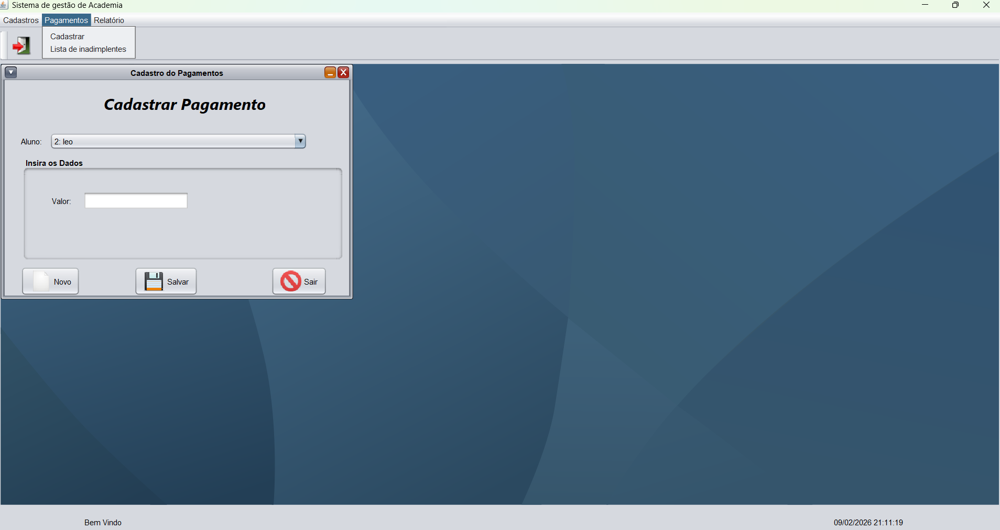
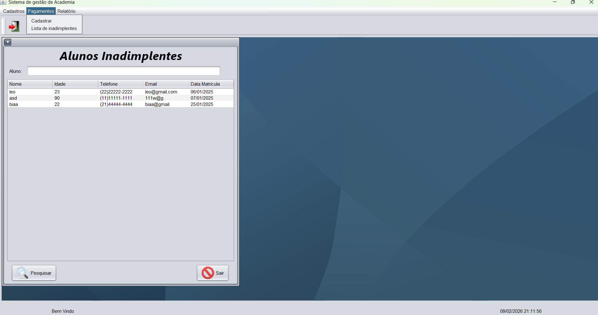
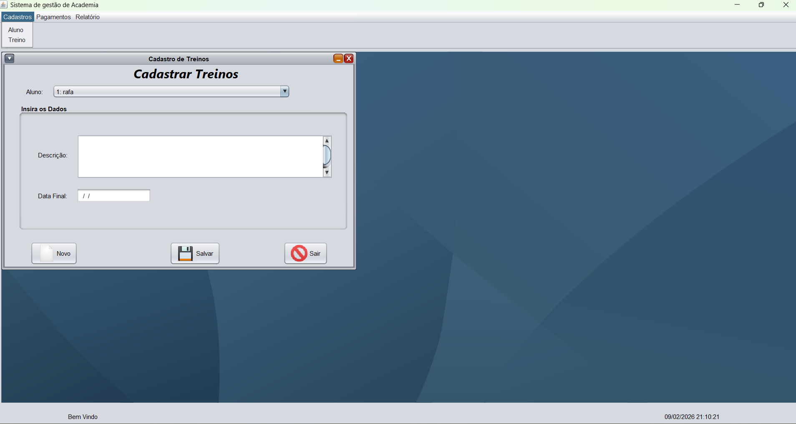

# Gym Management ERP System


## 📋 Project Overview

This project is a robust Desktop ERP (Enterprise Resource Planning) solution designed for Gym Administration. It was engineered to solve real-world business problems such as member tracking, financial control, and workout scheduling.

**Engineering Focus:**
Unlike simple CRUD applications, this project focuses on **Software Architecture** and **Data Integrity**. It implements the **Model-View-Controller (MVC)** design pattern to ensure separation of concerns and uses a custom **DAO (Data Access Object)** layer for efficient database communication without relying on heavy ORM frameworks.

## 🚀 Key Features

* **Member Management:** Complete lifecycle management (Registration, Updates, History).
* **Financial Control:** Logic for tracking payments, identifying overdue accounts (defaulters), and generating financial reports.
* **Access Control:** Role-based authentication for administrators and staff.
* **Data Integrity:** Enforced through rigorous SQL constraints and foreign keys within a normalized database schema.

## 🛠️ Tech Stack & Architecture

This project demonstrates a "Building from Scratch" approach to understand the core fundamentals of Backend Engineering.

* **Language:** Java (JDK 17+)
* **Database:** MySQL (Relational Design)
* **Architecture:** MVC (Model - View - Controller)
* **Persistence:** JDBC (Java Database Connectivity) with custom DAO implementation.
* **Design Patterns Used:**
    * **Singleton:** For database connection management (`ConFactory`).
    * **DAO:** To abstract and encapsulate all access to the data source.
    * **Factory:** To generate connection instances.

## 🗄️ Database Design (Backend Highlight)

The application uses a normalized relational database designed to minimize redundancy.

* **Key Tables:** `Aluno` (Member), `Pagamento` (Payment), `Treino` (Workout), `Funcionario` (Staff).
* **Optimization:** Custom SQL queries optimized for reporting views using `JOINs` to aggregate data efficiently.

```sql
-- Example of the underlying SQL logic designed for this system
SELECT a.nome, p.data, p.valor 
FROM Aluno a 
JOIN Pagamento p ON a.id = p.aluno_id 
WHERE p.status = 'PENDING';
```

## 📸 Application Screenshots

*(Note: The user interface is currently in Portuguese, targeted at the local Brazilian market, but the underlying architecture follows international engineering standards.)*

### 🖥️ Main Interface
<div align="center">
  
</div>

### ⚙️ Key Modules & Features

| **Member Management** | **Financial Control (Payments)** |
|:---:|:---:|
| *Complete registration logic with validation* | *Payment tracking and financial history* |
|  |  |

| **Business Logic: Defaulters** | **Workout Management** |
|:---:|:---:|
| *Automated filtering of overdue accounts (SQL Logic)* | *Workout assignment and tracking* |
|  |  |


## ⚙️ How to Run

1. **Clone the repository:**
   ```bash
   git clone [https://github.com/RafahelMatias/academia-java.git](https://github.com/RafahelMatias/academia-java.git)```


2. **Database Setup:**

    Import the CriaBancoAcademia.sql file into your MySQL instance.

    Configure the connection string in src/main/java/persistencia/ConFactory.java.

3. **Build & Run:**

    Open the project in IntelliJ, NetBeans or Eclipse (Maven project).

    Run the main class: apresentacao.fmLogin.

    Login Credentials:

        User: user
        Password: 123

Author: Rafahel Matias Software Engineer specializing in Backend Development & Automation.